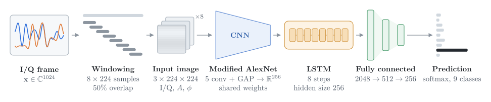

# CNN-LSTM Hybrid Architecture for Over-the-Air Automatic Modulation Classification using SDR

Dinanath Padhya, Krishna Acharya, Bipul Kumar Dahal, Dinesh Baniya Kshatri  
Thapathali Campus, Institute of Engineering, Tribhuvan University, Kathmandu, Nepal  
*Journal of Innovations in Engineering Education*, Vol. 8, No. 1, pp. 32–39, 2025

**[Project page](https://whoisdinanath.github.io/amc/)** · **[Paper](https://www.nepjol.info/index.php/jiee/article/view/82136/67472)** · **[DOI](https://doi.org/10.3126/jiee.v8i1.82136)**



Notebooks for the paper. Each 1024-sample I/Q frame is split into eight overlapping windows of 224 samples. A modified AlexNet turns each window into a 256-dimensional feature vector, an LSTM models the sequence of eight vectors, and a fully connected head predicts one of nine modulation schemes: BPSK, QPSK, 8PSK, 16QAM, 64QAM, AM-DSB-SC, AM-SSB-SC, FM and GMSK. The model is trained on RadioML 2018.01A combined with signals generated in GNU Radio, at SNRs from 0 to 30 dB.

## Results

Test-set results from Table 2 of the paper. Precision, recall and F1 are macro averages over the nine classes; the best value in each column is in bold.

| Configuration | Accuracy (%) | Precision (%) | Recall (%) | F1 (%) |
| --- | ---: | ---: | ---: | ---: |
| Batch size 16 | 91.46 | 91.46 | 91.46 | 91.33 |
| Batch size 32 | 91.34 | 91.47 | 91.34 | 91.30 |
| Batch size 32, tuned | **93.48** | 93.53 | **93.48** | **93.45** |
| Single-head attention | 93.34 | **93.56** | 93.34 | 93.22 |

## Repository structure

| Notebook | Purpose |
| --- | --- |
| [`01_mixup_with_radioml`](notebooks/01_mixup_with_radioml.ipynb) | Keeps nine classes of RadioML 2018.01A at SNR ≥ 0 dB and merges them with the generated signals (AWGN and noise-free) into one HDF5 file. This is the dataset used in the paper. |
| [`02_custom_dataset_mixup`](notebooks/02_custom_dataset_mixup.ipynb) | Builds a ten-class variant (adds GFSK) from generated signals only. |
| [`03_parameter_tuning`](notebooks/03_parameter_tuning.ipynb) | Hyperparameter search with Ray Tune and the ASHA scheduler. |
| [`04_train`](notebooks/04_train.ipynb) | Preprocessing, model definition and training; keeps the checkpoint with the lowest validation loss. |
| [`05_inference`](notebooks/05_inference.ipynb) | Test-set evaluation and ONNX export. |
| [`06_plots`](notebooks/06_plots.ipynb) | Figures: theoretical symbol error rates, constellation diagrams, tuning curves and results for each configuration. |
| [`07_attention_plots`](notebooks/07_attention_plots.ipynb) | Figures for the attention variant. |
| [`08_attention_comparison_plots`](notebooks/08_attention_comparison_plots.ipynb) | The tuned model and the attention variant side by side. |

Notebooks 06–08 plot from saved `.npy` arrays (predictions and training histories), which are not tracked in the repository.

## Setup

```bash
git clone https://github.com/whoisdinanath/amc-using-cnn-lstm.git
cd amc-using-cnn-lstm
pip install -r requirements.txt
```

`04_train` keeps the windowed training set on the GPU in float32 (about 9 GB for the nine-class dataset), so a GPU with 16 GB of memory is recommended.

## Data

- **RadioML 2018.01A:** download `GOLD_XYZ_OSC.0001_1024.hdf5` from [DeepSig](https://www.deepsig.ai/datasets).
- **Generated signals:** the GNU Radio recordings (pickled dictionaries keyed by `(modulation, SNR)`) are not included in this repository.

Dataset and checkpoint paths in the notebooks point to the Kaggle inputs used for the paper; update `dataset_path` and the checkpoint paths before running.

## Reproducing the paper

1. Run `01_mixup_with_radioml` to build `GOLD_XYZ_OSC_POSITIVE_COMBINED.hdf5` (nine classes, 779,688 frames).
2. In `04_train`, point `dataset_path` to that file and set `params["num_classes"] = 9` and `modulation_schemes = range(9)`; the notebook is currently configured for the ten-class dataset from `02_custom_dataset_mixup`. Training uses Adam with a learning rate of 1.5 × 10⁻⁴, batch size 32, dropout 0.6 and 10 epochs.
3. Evaluate the best checkpoint with `05_inference`.

## Over-the-air demo

The PyQt desktop application used for the over-the-air tests (live capture with an RTL-SDR, ONNX inference) is maintained in a separate repository: [krishna-ji/automatic-rf-identification-for-intelligent-communication-using-cnn-lstm](https://github.com/krishna-ji/automatic-rf-identification-for-intelligent-communication-using-cnn-lstm).

## Citation

```bibtex
@article{padhya2025cnnlstm,
  title   = {{CNN-LSTM} hybrid Architecture for over-the-air Automatic
             Modulation Classification using {SDR}},
  author  = {Padhya, Dinanath and Acharya, Krishna and Dahal, Bipul Kumar
             and Baniya Kshatri, Dinesh},
  journal = {Journal of Innovations in Engineering Education},
  volume  = {8},
  number  = {1},
  pages   = {32--39},
  year    = {2025},
  doi     = {10.3126/jiee.v8i1.82136}
}
```

## License

The code is released under the [MIT License](LICENSE). The paper is published by JIEE under [CC BY-NC-ND 4.0](https://creativecommons.org/licenses/by-nc-nd/4.0/).

This work was carried out as a minor project in the Department of Electronics and Computer Engineering, Thapathali Campus.
